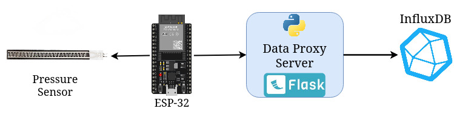
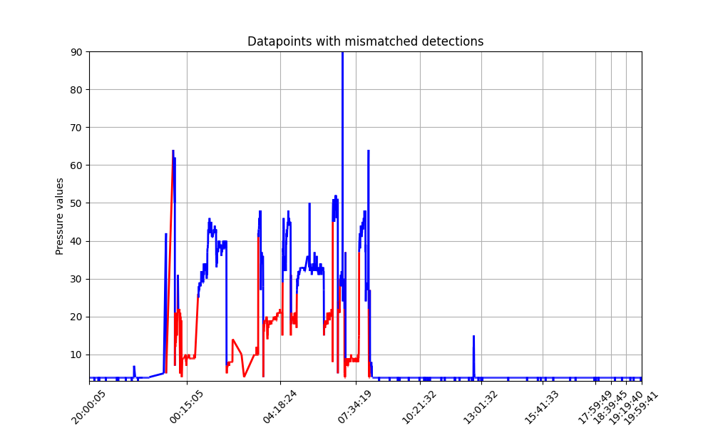
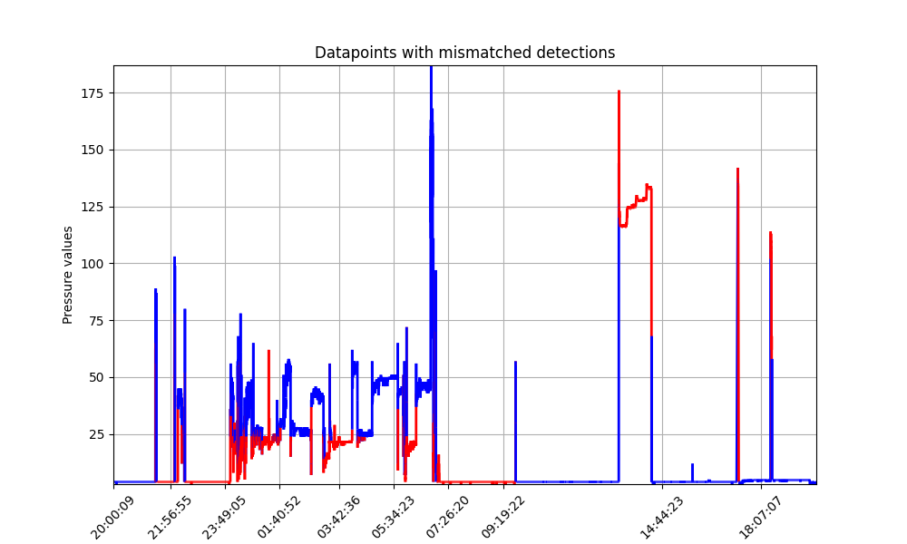
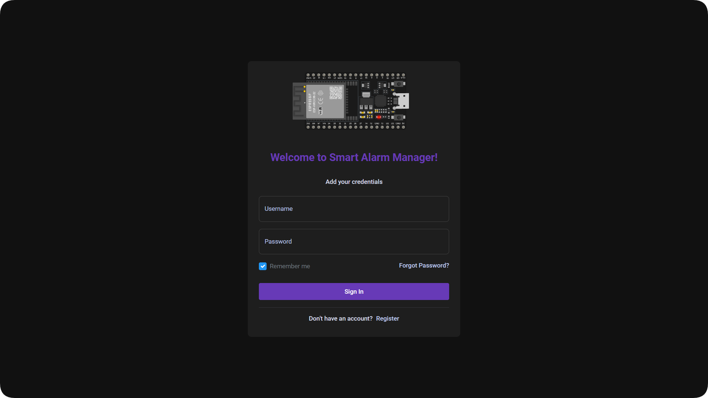
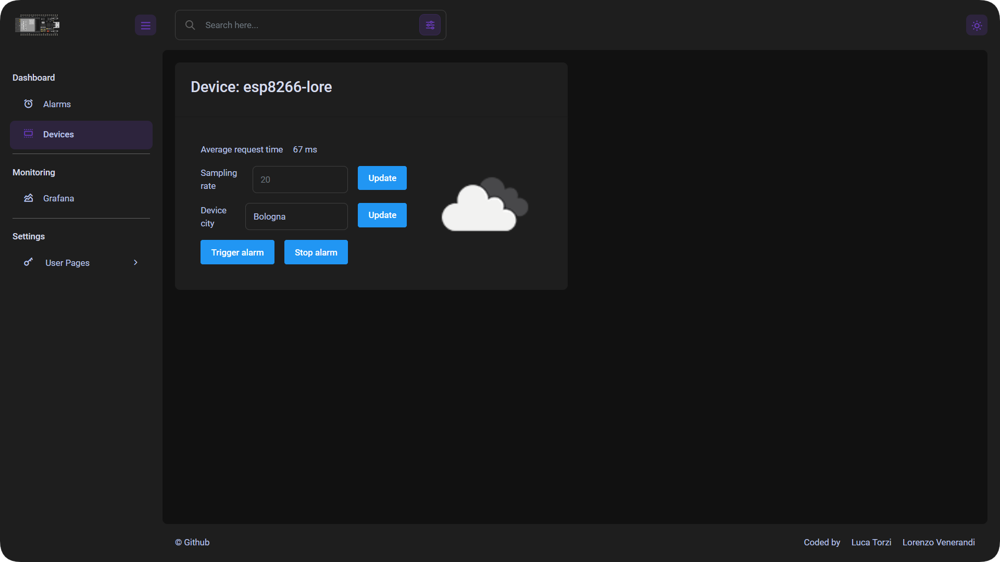
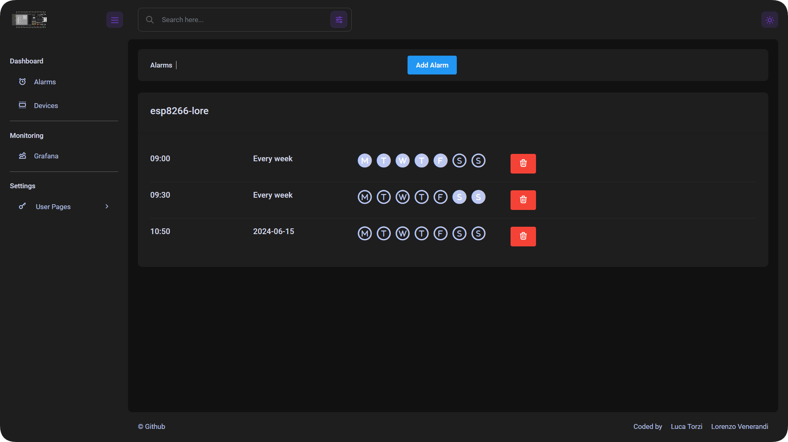
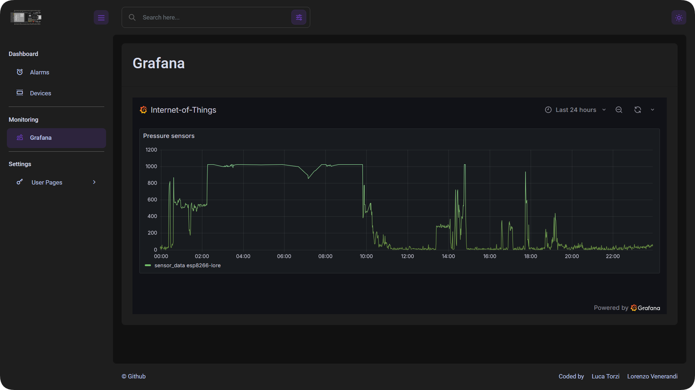

---
author:
- 
- 
title: IoT Alarm System with Bed Precense Detection
---

# Introduction

Traditional alarm clock can be disruptive and they could make the waking
experience hard to endure. To make it less-intrusive, we designed an
IoT-based alarm system that incorporate bed presence detection to ensure
the alarm is only triggered when the user is in bed, and it is
automatically set off when the user gets up. Moreover we check if the
user gets up properly from the bed to avoid the case that after the
deactivation of the alarm the user could return in the bed and fall
asleep again. We collect data using a pressure map sensor and a ESP32
and save them in a time-series database (InfluxDB). An user could
visualize these data via a graphical web application, that also offers
the opportunity to manage the alarms and trigger or stop the
reproduction of the tone from the selected device. We developed a
telegram bot such that these functions could also be accessible from
this famous application, such that an user could interact easily with
this service from its own smartphone. To conclude, the tone reproduced
changes based on the current weather condition.

# Project's Architecture

The architecture is composed by different components

-   pressure sensor and speaker

-   the ESP32 is the edge device that collects the data and plays the
    tone of the alarm

-   the MQTT broaker enables the communication between the data proxy
    server and the device, in order to trigger actions on the latter

-   InfluxDB is the time-series database used to store the data
    collected by the micro-controller from the pressure sensor

-   the data proxy server receives the data and upload them to the
    database, moreover this module expose APIs to allow the
    communication with the micro-controller and the web application
    (showed in figure
    [\[fig:dashboard-device\]](#fig:dashboard-device){reference-type="ref"
    reference="fig:dashboard-device"}) through which an user could
    interact to manage the alarms and visualize the data collected in
    the database

-   the data analysis server analyzes the data collected in the
    database: this is done to determine the sleep hours for each day,
    detect the presence of the user on the bed, stop the tone
    reproduction if the user got up, determine the accuracy, precision,
    recall and f1 of the detection and data forecasting

-   telegram bot that allow the user to manage the alarms and trigger or
    stop the tone reproduction.

## Docker

All the components of the architecture are encapsulated using
Docker[^1], an open-source platform that automates the deployment,
scaling and management of applications within lightweight and portable
containers. Each container is built based on a `Dockerfile`, a template
that describes the steps that the Docker Engine has to take to
containerize the application.

## Kubernetes

The entire deployment of the application is done using Kubernetes[^2],
an open-source container orchestration platform designed to automate the
deployment, scaling and management of containerized applications. It
handles a variety of tasks such as load balancing, storage orchestration
and self-healing through automatic restarts, replication and scaling of
containers.\
In particular, our project made use of the following tools:

-   `Persistent Volume` and `Persistent Volume Claim` -- used to mount a
    local directory as volume inside the containers. In this way we can
    add persistance throughout application restart.

-   `ConfigMap` and `Secret` -- this files are loaded inside containers
    as environment variables and contain the local configuration
    parameters, like authentication credentials or server urls.

-   `Deployment` -- the actual application deployment, uses the
    container image and the tools specified above to deploy the
    application. It also handles restart policies and resource scaling.

-   `Service` -- Expose the container ports outside so the application
    can be reached outside the cluster. It also manages request
    load-balancing.

-   `Helm Charts` -- pre-packaged application that make use of all the
    tools specified above. Usually most of the common platforms (like
    InfluxDB, Grafana etc.) can be deployed through Helm.

## Components communication

The components communicate each other via the data proxy server and
using two different protocols, MQTT and HTTP. The ESP32 micro-controller
is subscribed to the topic `devices/esp_id` and via the MQTT protocol it
receives the commands that will trigger or stop the alarm and the
command to change the sampling rate of the pressure sensor values. These
messages are published by the data proxy server, that is the only
component that could directly communicate with the edge device. The
micro-controller sends the data, read from the sensor, to the data proxy
server using the HTTP protocol via a POST request. The communication
between the data proxy server and the data analysis server happens
through the HTTP protocol. And the Telegram Bot perform the actions
querying the data proxy server via HTTP POST requests too. The data
proxy server is also subscribed to a MQTT topic, that is
`devices/heartbeat`, where every esp will publish its current
configuration and the average time it takes for each data request.

## Pipeline

### Sensor data calibration

This part will collect the information about the values read from the
pressure sensor when there is the person in the bed and when there is
not, and save them in a file. This is done in this way:

-   the sampling rate is augmented

-   the alarm sounds for five seconds to signal the user to lay down on
    the bed

-   the micro-controller sends data to the data proxy server related to
    the values reported by the pressure sensor when the user is on the
    bed

-   the data analysis server computes the average of these values and
    save it

-   the alarm sounds for five seconds to signal the user to get up from
    the bed

-   the micro-controller sends data to the data proxy server related to
    the values reported by the pressure sensor when the user is not on
    the bed

-   the data analysis server computes the average of these values and
    save it

-   the sampling rate is reset to the default value.

These values, along with the identifier of the device, are saved in a
json file that is mounted as persistent volume on kubernetes, in order
to avoid repeating the calibration process at every restart of the
application. These values will be used by the data analysis server to
understand in which periods the user is and isn't on the bed.

### Data collection

The data collected by the pressure sensor are read by the ESP32
micro-controller and sent to the data proxy server every 30 seconds via
the HTTP protocol. The data proxy server will write each data points to
the time-series database (Figure
[1](#fig:readDataPipeline){reference-type="ref"
reference="fig:readDataPipeline"}). The data analysis server analyzes
these data to undestand if the user is on the bed or not and to compute
the amount of sleep hours done each day, when queried to the specific
APIs.

{#fig:readDataPipeline
width="48%"}

### Alarm triggered

When an alarm must be triggered, the data proxy server will first check
the presence of the user on the bed, querying the data analysis server
with a POST request to `data_analysis_url/analyze/sleeping`. If the user
is not on the bed then the alarm is not triggered, otherwise the data
proxy server will trigger the micro-controller publishing a message on
the topic of the correct device, selecting a specific tone to be
reproduced based on the current weather condition (it is possible to
choose between sunny, cloudy and rainy/foggy). Then it sends an HTTP
request to the data analysis server (with a GET HTTP request to
`data_analysis_url/analyze/check_sleep`), in order to signal that the
reproduction of the tone just started (Figure
[2](#fig:triggerAlarmPipeline){reference-type="ref"
reference="fig:triggerAlarmPipeline"}). The data analysis server will
create a thread that will handle the stop of the alarm. It asks the
micro-controller to augment the sampling rate (in order to stop the
alarm as soon as possible) doing an HTTP request to the data proxy
server (that will publish a message on the correct MQTT topic). Then it
starts to check if the last pressure values saved in the database signal
that the user woke up and, if it is the case, stops the tone
reproduction. After that it will check every 5 minutes if the user is
still awake, reading the values collected by the sensor in the last 5
minutes and verifying that the presence of the user is not detected. If
its presence is detected, then the alarm is triggered again. This check
will run until the first time where the user is not detected. At the end
the sampling rate is reduced and set again to the default value.

{#fig:triggerAlarmPipeline
width="48%"}

# Project's Implementation

## ESP firmware

{#fig:schematic width="48%"}

The ESP firmware is coded in C++ using the PlatformIO framework. This
framework provides powerful tools like remote debugging, serial
monitoring, library management and multiple devices; thanks to this last
feature the firmware can be flashed in both `ESP32` or `ESP8266`, the
more common and economic version.\
The main libraries used for the firmware are:

-   `PubSubClient` -- used for the MQTT connection and message handling

-   `ESP8266Wifi` -- handles the connection to the Wifi network

-   `ESP8266HttpClient` -- used to make the HTTP POST request with
    sensor data to the data proxy

-   `ESP8266Audio` -- it enables audio reproduction on background

The audio data needs to be converted from mp3 files to hex data using
the `xxd` unix tool, for example

::: minted
bash xxd -i audio-file.mp3 \> hex-file.h
:::

Once your header file is ready you have to add the `const` and `PROGMEM`
keywords to the variable declaration, making it like

::: minted
bash const unsigned char your_song_name\[\] PROGMEM
:::

The header file can then be imported and used in the main script. In our
project we just added three songs because we were limited by device
memory, this could be fixed by adding a MicroSD shield and loading the
files there.

## MQTT broaker

The MQTT broaker used is EMQX[^3]. It is a highly scalable and
open-source, designed for large-scale IoT and real-time messaging
applications. It is deployed on Kubernetes using the official Helm
Chart.

## InfluxDB

InfluxDB version 2.7.4 was deployed using the official docker image on
kubernetes. All the query to the db are done using the Python interface
`influxdb-client`.

## Grafana

Grafana[^4] is deployed on Kubernetes and linked to the InfluxDB client.
The `Internet-of-Things` dashboard displays the pressure sensor data for
each device. This dashboard is included in the data proxy dashboard
(figure
[\[fig:dashboard-grafana\]](#fig:dashboard-grafana){reference-type="ref"
reference="fig:dashboard-grafana"}).

## Data Proxy Server

The data proxy server is written in Python and uses Flask[^5], a
lightweight and flexible web framework. Through Flask it manages the
communication with the micro-controller and the data analysis server via
public APIs. The APIs exposed by the server are:

-   `/api/devices`, that returns the registred devices

-   `/api/sampling_rate`, that change the sampling rate of a device

-   `/api/sensor_data`, used by the micro-controller to send the data

-   `/api/alarms`, that returns all the alarms of a device

-   `/api/add_alarm`, to add a new alarm

-   `/api/remove_alarm`, to remove an alarm

-   `/api/trigger_alarm`, to trigger the reproduction of the tone on a
    device

-   `/api/stop_alarm`, to stop the reproduction of the tone on a device

-   `/api/city`, to set a city, used to obtain the weather information.

The front-end is developed using Flask templates with the Bootstrap
toolkit[^6] for styling. The dashboard is based on
`Flask Berry Bootstrap 5`[^7] template. At the end of this document you
can find the screenshots of the three pages of the Dashboard.\
The backend also uses `mqtt client` to connect to MQTT broker, so it can
recive the devices heartbeat (with their configuration) and send the
following commands to the `/devices/device_id` topic:

-   `sampling_rate [value]` -- update the sensor sampling rate

-   `trigger_alarm [integer value]` -- triggers the alarm with the
    specified song. If a bad selection is made the default song will
    play.

-   `stop_alarm` -- stops the alarm.

The application uses a thread scheduler to manage the weather and alarm
checker.\
The weather information is obtained by the Open Weather APIs[^8] and
it's used to select which song the alarm should play. The saved alarms
are checked every 60 seconds and stored in a local file mounted in the
persistent volume. The file is in `Yaml` format and stores the
configuration data and alarms for each device, here is an example.

::: minted
yaml devices: - device_id: esp8266-lore sampling_rate: 20
average_request_time: 82 city: Bologna icon: 03d weather: Clouds
alarms: - days: - '6' - '7' time: 09:30 - date: '2024-06-16' time: 10:00
:::

## Data Analysis Server

The data analysis server is written in Python. It analyzes the data
stored in the database and computes a variety of information. The API
exposed by this server are written using FastAPI[^9], a modern,
high-performance web framework for Python, designed for building APIs
quickly and efficiently. The APIs exposed by this service are:

-   `/analyze/compute_sleep_time_for_each_day`, that will compute the
    hours of sleep for each day and returns a dictionary containing, for
    each day, this information with the related metrics (accuracy,
    precision, recall and F1-score)

-   `/analyze/check_sleep`, that create a thread that will check if the
    user got up

-   `/analyze/sleeping`, that returns if the user is on the bed or not

-   `/analyze/get_weights`, that will start the sensor data calibration
    process

-   `/analyze/forecast`, that given the device id, the year, the month
    and the day, will forecast the values of the pressure sensor for
    that day.

### Compute the hours of sleep

To compute the hours of sleep the values collected by the sensor in the
last day are analyzed. Every value that is greater than a threshold (the
mean between the two values recorded during the data calibration
process) is detected as a sleep data point, otherwise it is detected as
a non-sleep data point. The hours of sleep are computed summing these
sleep periods. The final result is saved in a csv file, in order to do
not repeat the computation for the same days.

### Data Forecasting

To forecast the values of a specific day, the Prophet library[^10] is
used. To train the Prophet model, we used the values of the 4 previous
days, read from the database, and we augment them by 10 times, adding
Gaussian noise with mean 0 and variance 1. An example of data
forecasting for a day could be seen in the figure
[4](#fig:forecasting){reference-type="ref" reference="fig:forecasting"}.

{#fig:forecasting width="48%"}

## Telegram Bot

The telegram bot is written in Python using the `python-telegram-bot`
library[^11]. It offers an asynchronous interface for the Telegram Bot
API and, in addition, this library features a number of high-level
classes to make the development of bots easy and straightforward. To
performe all the operation, the bot query the data proxy server. The
commandw that a user could execute are:

-   `/help`, that shows an help message

-   `/get_devices`

-   `/get_alarms`

-   `/add_alarm`

-   `/remove_alarm`

-   `/update_alarm`

-   `/trigger_alarm`

-   `/stop_alarm`

In the figure [5](#fig:telegramBot){reference-type="ref"
reference="fig:telegramBot"} we could see the execution and output of
different commands.

{#fig:telegramBot width="48%"}

# Results

## Accuracy in detecting the user presence on the bed

In the figures [6](#fig:datapoints12){reference-type="ref"
reference="fig:datapoints12"} and
[7](#fig:datapoints13){reference-type="ref"
reference="fig:datapoints13"} we could see the data collected from a
sensor in two different days (for 24 hours, starting from 20 p.m. and
ending at 20 p.m. of the successive day). The blue line indicates that
the values are correctly classified by the data analysis server, instead
the red line indicate a mismatch with respect to the ground truth
values.

<figure id="fig:datapoints">
<figure id="fig:datapoints12">

<figcaption>Data collected on 2024-06-12.</figcaption>
</figure>
<figure id="fig:datapoints13">

<figcaption>Data collected on 2024-06-13.</figcaption>
</figure>
<figcaption>Data collected from the sensor in two different days. The
blue lines indicate that the classification done by the data analysis
server is correct, instead the red lines indicate a mismatch with
respect to the ground truth values.</figcaption>
</figure>

In the table [1](#tab:accuracy){reference-type="ref"
reference="tab:accuracy"} we could see the metrics that tell us how the
data analysis server is good in detecting the presence of a person on
the bed or not. This results show us that this method is sufficient but
do not obtain perfect results. This is also caused by the precision of
the sensor, because, how we could see in the figures
[6](#fig:datapoints12){reference-type="ref"
reference="fig:datapoints12"} and
[7](#fig:datapoints13){reference-type="ref"
reference="fig:datapoints13"}, the sleeping period is not completely
clear since the values reported by the sensor are affected by its own
position in the bed and by the position of the user too.

::: {#tab:accuracy}
    Day    Accuracy   Precision   Recall   F1-Score
  ------- ---------- ----------- -------- ----------
   Day 1     0.59       0.99       0.36      0.53
   Day 2     0.89        1.0       0.53      0.96
   Day 3     0.57       0.87       0.39      0.54
   Day 4     0.63       0.63       0.59      0.61

  : Accuracy, Precision, Recall and F1-Score about the classification
  done by the data analysis server on the values collected by the sensor
  in four different days.
:::

## Accuracy of the data forecasting

As we could see in the figure [4](#fig:forecasting){reference-type="ref"
reference="fig:forecasting"}, the data forecasting of the pressure
sensor values are not precise, this could be due to the small amount of
data available and due to the high variance in the recorded data. But in
the image we could see how the trend of the sinusoidal wave predicted
has a period that correspond to one day.

## Mean Latency

The micro-controller, every time that it sends the data to the data
proxy server, will save the time needed to receive a reply. The last 10
values will be sent to the data proxy server publishing a MQTT message
on the topic `devices/heartbeat`. Then the mean latency is computed and
displayed on the dashboard, as we could see in the figure
[\[fig:dashboard-device\]](#fig:dashboard-device){reference-type="ref"
reference="fig:dashboard-device"}.

::: figure*
{width="90%"}
:::

::: figure*
{width="90%"}
:::

::: figure*
{width="90%"}
:::

::: figure*
{width="90%"}
:::

[^1]: <https://www.docker.com/>

[^2]: <https://kubernetes.io/>

[^3]: <https://github.com/emqx/emqx>

[^4]: <https://grafana.com/>

[^5]: <https://flask.palletsprojects.com/en/3.0.x/>

[^6]: <https://getbootstrap.com/>

[^7]: <https://github.com/app-generator/flask-berry-dashboard>

[^8]: <https://openweathermap.org/>

[^9]: <https://fastapi.tiangolo.com/>

[^10]: <https://facebook.github.io/prophet/>

[^11]: <https://github.com/python-telegram-bot/python-telegram-bot>
